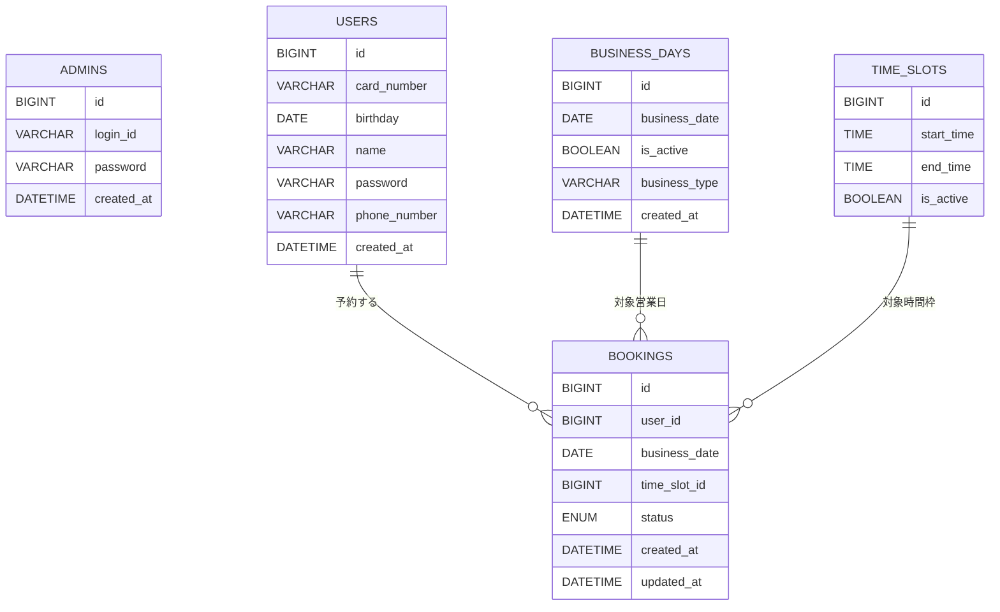

# ClinicAppointmentSystem

> **未経験からエンジニア転職を目指して開発した、病院の診療予約管理Webシステム**

---

## 目次

1. [プロジェクト概要](#プロジェクト概要)
2. [開発の背景と目的](#開発の背景と目的)
3. [使用技術](#使用技術)
4. [機能一覧](#機能一覧)
5. [技術的特徴・実装上の工夫](#技術的特徴・実装上の工夫)
6. [画面イメージ](#画面イメージ)
7. [データベース構成（ER図）](#データベース構成er図)
8. [アーキテクチャ・設計方針](#アーキテクチャ設計方針)
9. [二重予約防止・バリデーション](#二重予約防止バリデーション)
10. [テスト・品質](#テスト品質)
11. [ローカル開発環境セットアップ](#ローカル開発環境セットアップ)
12. [今後の課題・拡張予定](#今後の課題拡張予定)
13. [学び・工夫したポイント](#学び工夫したポイント)
14. [ライセンス](#ライセンス)
15. [作者](#作者)

---

## プロジェクト概要

ClinicAppointmentSystemは、病院の診療予約をWeb化し、患者と医療機関双方の利便性を向上させる予約管理システムです。  
従来の電話・紙台帳中心の予約管理で発生しがちな二重予約や確認作業の手間を解消します。  
**要件定義から設計・実装・テスト・運用まで全て個人で行い、未経験からの転職活動で「業務課題を自ら洗い出し、システム化できる力」を示すポートフォリオ**です。

---

## 開発の背景と目的

- **背景**  
  日本の中小規模病院では診療予約の多くが電話や窓口で行われており、オンライン予約の導入率は全国で約2割（2023年時点、医療IT調査）。特に個人クリニックでは手書き台帳が主流です。
  - 診療時間外は予約不可
  - 職員の電話対応負担
  - 二重予約・聞き間違い発生
  などの課題が日常的です。

- **目的**  
  患者が24時間オンラインで予約・キャンセルでき、職員がリアルタイムで状況管理できるWebシステムを目指しました。  
  **「シンプルで直感的なUI」**を重視しています。

---

## 使用技術

- Java 17 / Spring Boot 3.5  
- MyBatis（DBアクセス）  
- Thymeleaf（テンプレートエンジン）  
- Spring Security（認証・認可）  
- MySQL（スキーマ名: `clinic_booking_db`）  
- Bootstrap 5（UI）  
- Maven（ビルド管理）  
- Eclipse 2025-06（Pleiades日本語化）  
- Git / GitHub（バージョン管理）

---

## 機能一覧

| 区分   | 機能                      | 説明                                               |
| ------ | ------------------------- | -------------------------------------------------- |
| 患者   | ログイン                   | 診察券番号＋パスワードで認証                       |
| 患者   | 予約作成                   | 営業日と時間枠を選択し予約登録                     |
| 患者   | 予約確認                   | 内容確認後に確定                                  |
| 患者   | 予約一覧/キャンセル        | 自分の予約を一覧表示・キャンセル可能      　         |
| 管理者 | 管理者ログイン             | ID・パスワード認証                                 |
| 管理者 | 予約状況一覧               | 日別の予約を一覧表示                               |
| 管理者 | 営業日設定                 | 予約可能日の登録・削除。予約受付停止・再開           |

---

## 技術的特徴・実装上の工夫

- **共通レイアウトとパーツのフラグメント化**  
　全ページ共通のヘッダー・フッター・ナビゲーション・メッセージ表示などを`parts/common.html`や`parts/admin-common.html`としてThymeleafの`th:fragment`で部品化。各画面で`th:replace`/`th:include`により呼び出すことで、UIの統一と保守性を高めています。

- **レイアウトテンプレートによる骨組みの共通化**  
　各ページは共通のマスター（ベース）レイアウトを継承し、個別のコンテンツ部分だけを差し替える構造（レイアウトテンプレートパターン）としています。これによりHTML構造やリソース参照の重複を排除し、開発効率を向上させています。

- **患者・管理者ロールごとのUI最適化**  
　患者用・管理者用で共通パーツを分離し、それぞれに合わせたナビゲーションやメニュー構成とすることで、利用者ごとに最適なUI/UXを実現。ロールごとの機能追加・変更も容易です。

- **統一デザインの実現**  
　BootstrapとカスタムCSS（main.css）を併用し、配色・フォント・部品デザインの統一を徹底。どの画面でも一貫したUI/UXとなるよう配慮しています。

- **レイヤードアーキテクチャの徹底**  
　Controller・Service・Repositoryで責務を明確に分割。画面表示用DTOも設計し、ドメイン層とUI層の分離・保守性向上を実現しています。

- **MyBatisによる柔軟なデータ取得**  
　MyBatisのMapper XMLを活用し、複雑な条件検索やJOINによるデータ取得を効率的に実装。予約・営業日管理ロジックにも柔軟に対応しています。

---

## 画面イメージ

患者メイン画面（予約画面）

患者マイページ画面（予約情報確認・キャンセル画面）
%E3%82%B5%E3%83%B3%E3%83%97%E3%83%AB.png?raw=true)

管理者メイン画面（予約一覧表示画面）

営業日設定画面（予約可能日の事前設定用管理者画面）
%E3%82%B5%E3%83%B3%E3%83%97%E3%83%AB.png?raw=true)

---

## データベース構成（ER図・主要テーブル）

### テーブル概要
- **admins（管理者）**  
  システム管理者情報。独立テーブル（他と直接リレーションなし）。
- **users（患者）**  
  予約を行うユーザー。
- **business_days（営業日）**  
  予約可能な日を管理。
- **time_slots（時間枠）**  
  1日の中の予約枠。
- **bookings（予約）**  
  患者・営業日・時間枠を組み合わせて予約管理。

> ※ `bookings.business_date` と `business_days.business_date` は日付で論理的に関連します（外部キー制約無し）。

---

## アーキテクチャ・設計方針

- **レイヤー分離**  
  - `controller`（画面ロジック）
  - `service`（ビジネス処理）
  - `repository`（DBアクセス）
  - `domain`（エンティティ）
  - `dto`（画面表示用）
  - `config`（セキュリティ等）
- **MyBatis**  
  Mapperインタフェース＋XMLでSQLを柔軟に記述。複雑なJOINや制約も明確化。
- **Spring Security**  
  患者・管理者でFilterChainを分離。パスワードはBCryptで安全に管理。
- **UI/UX**  
  Bootstrapでモバイル対応。予約済み枠はdisabled表示、エラー/完了メッセージも明確に表示。

---

## 二重予約防止・バリデーション

- **アプリ層**  
  - 予約前に枠・同日重複・ユーザー重複を明示的にチェック。
  - 予約競合時は例外としてControllerでキャッチし適切なエラーメッセージを表示。
- **DB層（今後導入予定）**  
  - `bookings`テーブルに`(business_day_slot_id, status)`のユニーク制約を追加予定。
  - 同時に複数のリクエストが処理されるレースコンディションのような状況でも、DBレベルで整合性が保たれる設計。

---

## テスト・品質

- **単体テスト（JUnit + Mockito）**  
  BookingServiceの正常・異常系ユースケースを網羅したユニットテスト（`src/test/java/com/unknownclinic/appointment/service/BookingServiceTest.java`）を実装し、全テストケースがパス済みです。依存コンポーネント（MyBatis Mapper等）はMockitoでモック化し、ビジネスロジック単体の品質を担保しています。
- **MyBatis Mapperテスト**  
  H2インメモリDBを用いたSQL・マッピングの単体テスト設計を今後予定しています。
- **今後の計画**  
  CI/CD（GitHub Actionsによる自動テスト）、テストカバレッジ計測（JaCoCo等）、E2Eテストの導入も計画中です。

---

## ローカル開発環境セットアップ

1. リポジトリをクローン  
   `git clone https://github.com/yshtis/ClinicAppointmentSystem.git`
2. DB作成（MySQLにて）  
   `CREATE DATABASE clinic_booking_db;`
3. `src/main/resources/application.properties`を編集（DBパスワード等を調整）
4. ビルド＆起動  
   `mvn spring-boot:run`
5. ブラウザでアクセス  
   `http://localhost:8080`

---

## 今後の課題・拡張予定

- 管理者機能の拡張（営業日一括登録、予約CSV出力等）
- テスト自動化・CI/CDパイプライン導入
- 監査ログ・操作履歴の記録
- メール/SMSによる予約通知
- レスポンシブUI・アクセシビリティ改善

---

## 学び・工夫したポイント

- **職業訓練で培った実践的な開発経験やチーム開発演習を参考に、要件定義から設計・実装・テストまで現場を想定したワークフローを意識。利用者・運用者双方の視点を取り入れた設計・改善を重視した。**
- **業務要件の整理からDB設計・画面設計・実装まで、一貫して自分自身で担当し、主体的に開発を推進した。**
- **現場の"困りごと"（二重予約・確認作業の負担）を複数層で解決**
- **業務フローを紙台帳運用に近づける工夫（初めての方でも直感的に使えるUI）**
- **Bootstrapでスマホ・PCどちらからも見やすいUIを構築**
- **MyBatisでSQLを自ら記述し、DB設計やJOINを意識**
- **セキュリティ/認証（Spring Security）で患者・管理者の認証分離とハッシュ化管理**

---

## ライセンス

MIT License

---

## 作者

Yoshi Ishii / [GitHub](https://github.com/yshtis)

---

> **ご意見・ご指摘・アドバイス大歓迎です！お気軽にIssue/PRください。**
