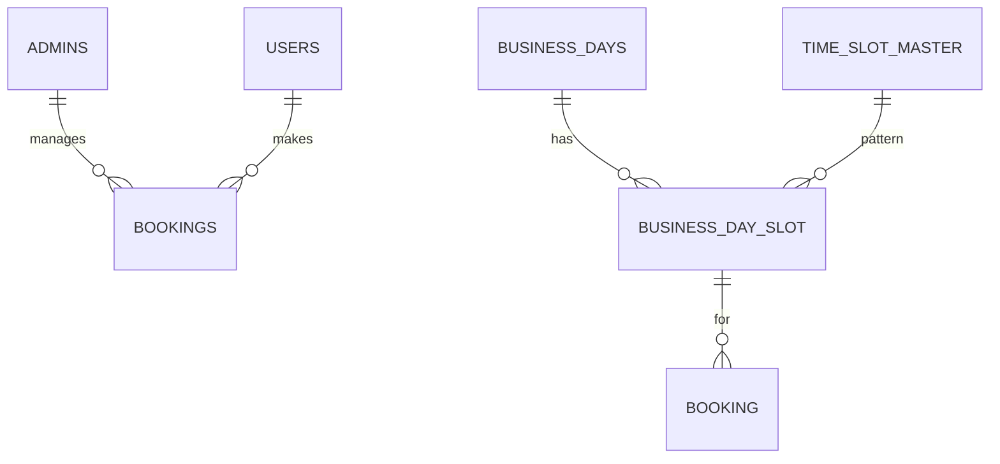

# ClinicAppointmentSystem

> **未経験からエンジニア転職を目指して開発した、病院の診療予約管理Webシステム**

---

## 目次

1. [プロジェクト概要](#プロジェクト概要)
2. [開発の背景と目的](#開発の背景と目的)
3. [使用技術](#使用技術)
4. [機能一覧](#機能一覧)
5. [画面イメージ](#画面イメージ)
6. [データベース構成（ER図）](#データベース構成er図)
7. [アーキテクチャ・設計方針](#アーキテクチャ設計方針)
8. [二重予約防止・バリデーション](#二重予約防止バリデーション)
9. [テスト・品質](#テスト品質)
10. [ローカル開発環境セットアップ](#ローカル開発環境セットアップ)
11. [今後の課題・拡張予定](#今後の課題拡張予定)
12. [学び・工夫したポイント](#学び工夫したポイント)
13. [ライセンス](#ライセンス)
14. [作者](#作者)

---

## プロジェクト概要

ClinicAppointmentSystemは、病院の診療予約をWeb化し、患者と医療機関双方の利便性を向上させる予約管理システムです。  
従来の電話・紙台帳中心の予約管理で発生しがちな二重予約や確認作業の手間を解消します。  
**要件定義から設計・実装・テスト・運用まで全て個人で行い、未経験からの転職活動で「業務課題を自ら洗い出し、システム化できる力」を示すポートフォリオ**です。

---

## 開発の背景と目的

- **背景**  
  日本の中小規模病院では診療予約の多くが電話や窓口で行われており、オンライン予約の導入率は全国で約2割（2023年時点、医療IT調査）。特に個人クリニックでは手書き台帳が主流です。
  - 診療時間外は予約不可
  - 職員の電話対応負担
  - 二重予約・聞き間違い発生
  などの課題が日常的です。

- **目的**  
  患者が24時間オンラインで予約・キャンセルでき、職員がリアルタイムで状況管理できるWebシステムを目指しました。  
  **「シンプルで直感的なUI」**も重視しています。

---

## 使用技術

- Java 17 / Spring Boot 3.5  
- MyBatis（DBアクセス）  
- Thymeleaf（テンプレートエンジン）  
- Spring Security（認証・認可）  
- MySQL（スキーマ名: `appointment_system_db`）  
- Bootstrap 5（UI）  
- Maven（ビルド管理）  
- Eclipse 2025-06（Pleiades日本語化）  
- Git / GitHub（バージョン管理）

---

## 機能一覧

| 区分   | 機能                      | 説明                                               |
| ------ | ------------------------- | -------------------------------------------------- |
| 患者   | ログイン                   | 診察券番号＋パスワードで認証                         |
| 患者   | 予約作成                   | 営業日と時間枠を選択し予約登録                     |
| 患者   | 予約確認                   | 内容確認後に確定                                   |
| 患者   | 予約一覧/キャンセル        | 自分の予約を一覧表示・キャンセル可能               |
| 管理者 | 管理者ログイン             | ID・パスワード認証                                 |
| 管理者 | 予約状況一覧               | 日別の予約を一覧表示                               |
| 管理者 | 営業日設定                 | 予約可能日の登録・削除                             |
| 共通   | ヘッダー/フッター共通化    | Thymeleafの`th:fragment`で管理                     |

---

## 画面イメージ

<!-- スクリーンショット例を貼るとより効果的です -->

)

---

## データベース構成（ER図）

- **主なテーブル**
  - `admins`（管理者）
  - `users`（患者/利用者）
  - `business_days`（営業日マスタ）
  - `time_slot_master`（時間枠マスタ）
  - `business_day_slots`（営業日ごとの有効枠）
  - `bookings`（予約）

---

## アーキテクチャ・設計方針

- **レイヤー分離**  
  - `controller`（画面ロジック）
  - `service`（ビジネス処理）
  - `repository`（DBアクセス）
  - `domain`（エンティティ）
  - `dto`（画面表示用）
  - `config`（セキュリティ等）
- **MyBatis**  
  Mapperインタフェース＋XMLでSQLを柔軟に記述。複雑なJOINや制約も明確化。
- **Spring Security**  
  患者・管理者でFilterChainを分離。パスワードはBCryptで安全に管理。
- **UI/UX**  
  Bootstrapでモバイル対応。予約済み枠はdisabled表示、エラー/完了メッセージも明確に表示。

---

## 二重予約防止・バリデーション

- **アプリ層**  
  - 予約前に枠・同日重複・ユーザー重複を明示的にチェック
  - 予約競合時は例外としてControllerでキャッチ＆表示
- **DB層（今後導入予定）**  
  - `bookings`テーブルに`(business_day_slot_id, status)`のユニーク制約を追加し、レースコンディションでも二重予約を根本防止

---

## テスト・品質

- **単体テスト（JUnit）**  
  BookingServiceの正常/異常系ユースケースをテスト
- **MyBatis Mapperテスト**  
  H2テストDBでSQL/マッピング確認
- **今後**  
  CI/CD（GitHub Actions）、カバレッジ計測、E2Eテストも導入予定

---

## ローカル開発環境セットアップ

1. リポジトリをクローン  
   `git clone https://github.com/yshtis/ClinicAppointmentSystem.git`
2. DB作成（MySQLにて）  
   `CREATE DATABASE appointment_system_db;`
3. `src/main/resources/application.yml`を編集（DBパスワード等を調整）
4. ビルド＆起動  
   `mvn spring-boot:run`
5. ブラウザでアクセス  
   `http://localhost:8080`

---

## 今後の課題・拡張予定

- DBユニーク制約による二重予約防止の強化
- 管理者機能の拡張（営業日一括登録、予約CSV出力等）
- テスト自動化・CI/CDパイプライン導入
- 監査ログ・操作履歴の記録
- メール/SMSによる予約通知
- レスポンシブUI・アクセシビリティ改善

---

## 学び・工夫したポイント

- **業務要件の整理～DB/画面設計～実装まで一貫して自力で作成**
- **現場の"困りごと"（二重予約・確認作業の負担）を複数層で解決**
- **MyBatisでSQLを自ら記述し、DB設計やJOINを意識**
- **Bootstrapでスマホ・PCどちらからも見やすいUIを構築**
- **業務フローを紙台帳運用に近づける工夫（初めての方でも直感的に使えるUI）**
- **セキュリティ/認証（Spring Security）で患者・管理者の認証分離とハッシュ化管理**

---

## ライセンス

MIT License

---

## 作者

Yoshi Ishii / [GitHub](https://github.com/yshtis)

---

> **ご意見・ご指摘・アドバイス大歓迎です！お気軽にIssue/PRください。**
