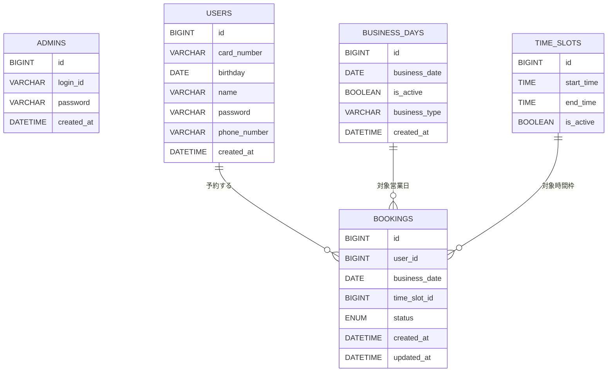

# ClinicAppointmentSystem

> **未経験からエンジニアへ。実務を意識して作った病院予約システム**

---

## 目次

1. [プロジェクト概要](#プロジェクト概要)
2. [なぜ作ったか](#なぜ作ったか)
3. [使用技術](#使用技術)
4. [主な機能](#主な機能)
5. [実装で工夫したこと](#実装で工夫したこと)
6. [アーキテクチャ](#アーキテクチャ)
7. [二重予約防止](#二重予約防止)
8. [テスト](#テスト)
9. [セットアップ](#セットアップ)
10. [画面例](#画面例)
11. [DB構成](#db構成)
12. [今後やりたいこと](#今後やりたいこと)

---

## プロジェクト概要

病院の診療予約を電話・紙台帳から**Webシステム化**したデモプロジェクトです。

患者は24時間オンラインで予約・キャンセルでき、病院側はリアルタイムで予約状況を把握できます。二重予約や聞き間違いといった従来の課題を解決することを目指しています。

**転職活動用に作った作品です。** 要件定義から設計・実装・テスト・運用まで、すべて一人で行いました。「業務課題を自分で洗い出し、システムで解決する」という姿勢を示したかったのが意図です。

---

## なぜ作ったか

実務を想定すると「何が課題か」「どう解決するか」を一から考える力が大事だと感じました。

病院の予約管理は身近な業務で、実際の問題点（電話対応の負担、二重予約のリスク）が明確です。その課題に対して、Webシステムという現実的な解決策を形にすることで、実践的な開発経験を示したいと思いました。

---

## 使用技術

| 役割 | 技術 |
|------|------|
| バックエンド | Java 17, Spring Boot 3.5, Spring Security |
| DB | MySQL, MyBatis |
| フロントエンド | Thymeleaf, Bootstrap 5, HTML/CSS |
| ツール | Maven, Eclipse 2025-06, Git |

---

## 主な機能

### 患者向け
- **ログイン/新規登録** 診察券番号とパスワードで認証
- **予約作成** 営業日と時間枠を選んで予約
- **予約管理** 予約一覧の確認・キャンセル
- **パスワードリセット** 忘れた場合の再設定

### 管理者向け
- **管理者ログイン** ID/パスワード認証
- **予約確認** 日別の予約状況を一覧表示
- **営業日設定** 予約可能日の登録・管理

---

## 実装で工夫したこと

### パーツ化による保守性向上
ヘッダー・フッター・ナビゲーションなどを共通パーツ（`parts/common.html`）として Thymeleaf フラグメントで分離。画面を増やす時も修正箇所が少なくなります。

### 患者・管理者で UI を分離
それぞれのロールに最適なナビゲーションとメニューを用意。ユーザーが迷わないようにシンプルな構成を心がけました。

### 責務の明確な設計
Controller → Service → Repository と層を分け、テストしやすい構成に。データベースアクセスも MyBatis で SQL を明示的に書いて、処理の意図がはっきりわかるようにしています。

### Bootstrap でレスポンシブ対応
スマホ・タブレット・PCどの画面からでも使いやすいように。予約済み枠は `disabled` 表示して、誤操作を防いでいます。

---

## アーキテクチャ

```
controller  ← 画面の操作を受け取る
    ↓
service     ← ビジネスロジック（二重予約チェック等）
    ↓
repository  ← DB操作
    ↓
domain      ← データの構造
```

**認証について**  
Spring Security で患者と管理者のログイン処理を分離。パスワードは BCrypt でハッシュ化して保存しています。

---

## 二重予約防止

同じ患者が同じ日時に複数予約しないよう、複数の層で対策しています。

1. **DB へ登録する前に Service 層でチェック** → 既存予約があればエラーを返す
2. **画面でも制御** → 満枠の時間枠は選べない状態にする
3. **入力値を厳密にチェック** → 不正な日付や過去の日付は受け付けない

ユーザーが何か間違えたときは、画面に分かりやすいエラーメッセージを表示します。

---

## テスト

JUnit + Mockito で、BookingService の正常系・異常系をテストしています。予約作成時の成功/失敗ケースを想定してテストを書きました。

（`src/test/java/com/unknownclinic/appointment/service/BookingServiceTest.java`）

---

## セットアップ

```bash
# リポジトリをクローン
git clone https://github.com/yshtis/ClinicAppointmentSystem.git

# MySQL でデータベースを作成
mysql -u root -p
CREATE DATABASE clinic_booking_db;
exit

# 設定ファイルを編集（DB接続情報）
# src/main/resources/application.properties を開いて、
# DB のユーザー名とパスワードを自分の環境に合わせる

# ビルド & 起動
mvn spring-boot:run

# ブラウザで http://localhost:8080 にアクセス
```

---

## 画面例

**患者の予約画面**  


**患者のマイページ（予約確認・キャンセル）**  


**管理者の予約確認画面**  


**管理者の営業日設定画面**  


---

## DB構成


```mermaid
erDiagram
    ADMINS {
        BIGINT id
        VARCHAR login_id
        VARCHAR password
        DATETIME created_at
    }
    USERS {
        BIGINT id
        VARCHAR card_number
        DATE birthday
        VARCHAR name
        VARCHAR password
        VARCHAR phone_number
        DATETIME created_at
    }
    BUSINESS_DAYS {
        BIGINT id
        DATE business_date
        BOOLEAN is_active
        VARCHAR business_type
        DATETIME created_at
    }
    TIME_SLOTS {
        BIGINT id
        TIME start_time
        TIME end_time
        BOOLEAN is_active
    }
    BOOKINGS {
        BIGINT id
        BIGINT user_id
        DATE business_date
        BIGINT time_slot_id
        ENUM status
        DATETIME created_at
        DATETIME updated_at
    }

    USERS ||--o{ BOOKINGS : "予約する"
    BUSINESS_DAYS ||--o{ BOOKINGS : "対象営業日"
    TIME_SLOTS ||--o{ BOOKINGS : "対象時間枠"
```

| テーブル | 役割 |
|----------|------|
| **admins** | システム管理者 |
| **users** | 患者 |
| **business_days** | 予約可能な営業日 |
| **time_slots** | 1日の中の時間枠（例：9:00-9:30） |
| **bookings** | 予約記録（患者 × 営業日 × 時間枠） |

---

## 今後やりたいこと

- 管理者機能の拡張（営業日一括登録、CSV出力）
- 自動テスト & CI/CD パイプライン
- メール/SMS による予約通知
- スマートフォンアプリ化
- アクセシビリティ改善

---

> **ご指摘・アドバイスいつでも歓迎です。Issue/PR をお気軽に！**

